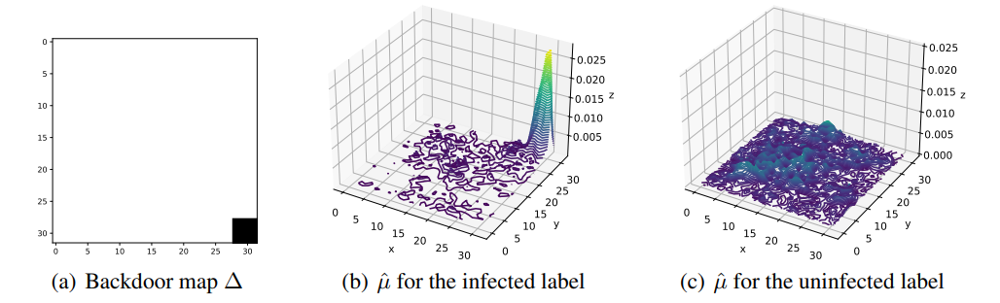
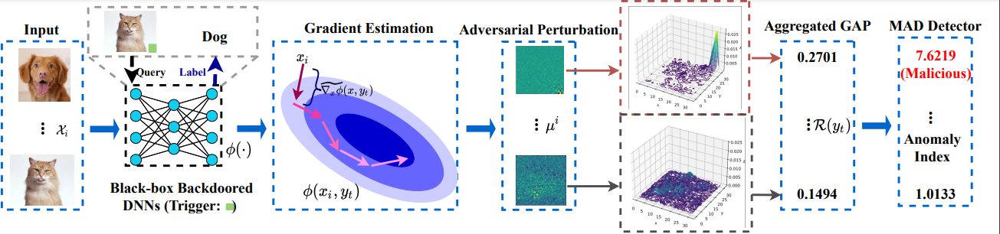

# Aeva-Blackbox-Backdoor-Detection (**ICLR 2022**) 
The code for: Detecting Backdoors in Black-box Neural Networks via Adversarial Extreme Value Analysis (**ICLR 2022**)


# BEFORE YOU RUN THIS CODE

We appreciate your interest in AEVA: Detecting Backdoors in Black-box Neural Networks via Adversarial Extreme Value Analysis and use our code. 






The detailed instructions are shown below.

# DEPENDENCIES 

Our code is implemented using Keras with TensorFlow backend. Following packages are required.

```bash
keras==2.2.4

tensorflow-gpu==2.3.1

Our code is tested on Python 3.8.3
```
We include a sample script demonstrating how to perform Aeva on an backdoor-infected model. There are several parameters that need to be set before running the code:

On GPU device: 
if you are using GPU, specify which GPU you would like to use by setting the DEVICE variable via
```bash
os.environ["CUDA_VISIBLE_DEVICES"] = "0"
```

If you want to test the code on your own models, please specify the path to the model varialble in detect_main.py.

# Results in the Paper 

To understand the performance of AEVA on backdoor-infected model with a single infected label, we here use CIFAR-10 and CIFAR-100 two models (ResNet) to show the peformance of AEVA, since CIFAR-10 and CIFAR-100 datasets can be easily accessed in Keras. Specifically, for each task, we store a backdoor-infected model in the "saved_models" package. Each model is embedded with a 4x4 backdoor square. 

For example, you can access CIFAR-10 model throuhg:
```bash 
import tensorflow.keras as keras
model=keras.models.load_model("saved_models/cifar10_backdoor.h5")
```
Notably, we preprocess each sample into [0,1].

To obtain the adversarial perturbations for CIFAR-10 using AEVA, you can run:


```bash
python -u detect_main.py --sp 0 --ep 10 --cuda 0 --task cifar10

```

Similarly, for CIFAR-100 :

```bash
python -u detect_main.py --sp 0 --ep 100 --cuda 0 --task cifar100

```

You can also investigate the impact for the number of the infected label through modifying "--sp" and "--ep". The default number of samples used for AEVA is 40.


The adversarial perturbations are stored in the "cifar10_adv_per" or "cifar100_adv_per" two packages. 

To further calculate the anomaly index for each label, we can run after setting the path for stored adversarial perturbations:


```bash
python outlier.py 
```


The results will give us the Global Adversarial Peak(GAP) and anomaly index for each label. 
For example:

```bash
Global Adversarial Peak(GAP): [0.14533126 0.08231069 0.06113102 0.06526258 0.06199296 0.06474132
 0.05325177 0.06903553 0.09275569 0.07373303]
Anomaly Index: [ 8.36901293  1.62297756 -0.64420006 -0.20193759 -0.55193415 -0.25773579
 -1.48763492  0.20193759  2.7410618   0.70478146]
```

From above results, we can find that the first label deemed as the infected (i.e., anomaly index larger than 4).

# Results for Dynamic Backdoor triggers
Due to the space constraint, we include four models infected with dynamic and non-compact backdoor triggers in "saved_models/Dynamic_backdoor_model/". We upload remaining 6 backdoor infected models in https://drive.google.com/drive/folders/1D2om8FlYt9T6tZ8Lu81l34lAWRy04d0s?usp=sharing. The results for one of ResNet-44 model are shown as:   

```bash
Global Adversarial Peak(GAP):[0.36433247 0.16292 0.18040664 0.20698954 0.20037229 0.16336469
 0.17756703 0.17803021 0.16818275 0.17449666]
Anomaly Index:[10.46289861 -0.8345591   0.14628692  1.63735197  1.26618296 -0.80961594
 -0.01299003  0.01299003 -0.53936558 -0.18521095]
```
# Citation
If you find our implementaion is helpful, please cite:
```bash
@inproceedings{
guo2022aeva,
title={{AEVA}: Black-box Backdoor Detection Using Adversarial Extreme Value Analysis},
author={Junfeng Guo and Ang Li and Cong Liu},
booktitle={International Conference on Learning Representations},
year={2022},
url={https://openreview.net/forum?id=OM_lYiHXiCL}
}
```

